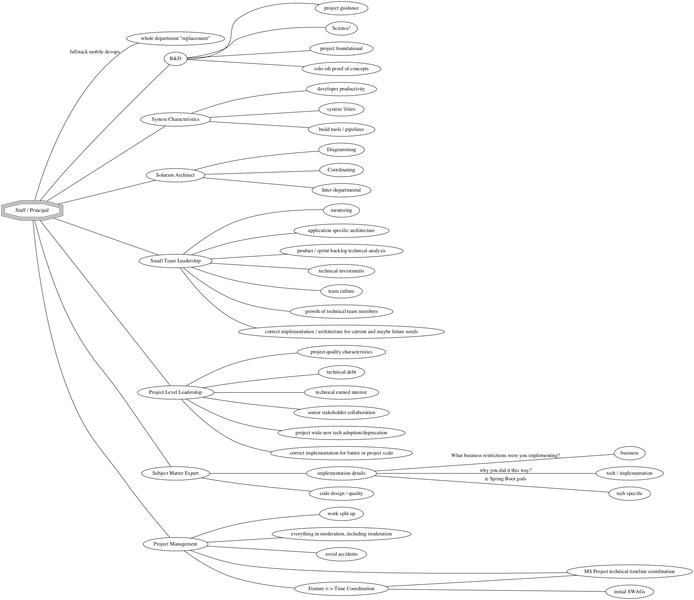

I'm a Principal Engineer, but as I explore the Twitter and tech spheres to see other peers in my role, I'm struct by just how _different_ we all are.

Of course, this is reflect a bit by the industries inability to stablize around what a Senior developer means. Does it mean a Rails developer with 2 years experience? Does it mean someone with a dozen years experience? _It Depends!_.

So it makes sense that whatever's after Senior is pretty random too. Does your organization have a ladder that calls the next level, the one after Senior Developer, Staff or Principal? And if so, are people with that title relatively sparse on the ground, or can you throw a nerf ball into any crowded conference room and hit a couple?

So I made a mind-map.

This is not a mindmap of "what it takes _to be_ a senior+ developer" but it's a mindmap of **"if you're a senior+ developer you maybe be asked to do 2-3 of the big things on this list**.

You do _not_ need to know all the list to be a senior+ developer. In some cases they are directly opposed so you likely can't know it all (the person that deeply understands DNS at a foundational level is unlikely to _also_ be a full-stack-mobile-devops "small department in a human/unicorn").

I may - likely - have some of this wrong! Pull requests and conversation welcome, edit the dot file this  image is generated from!
